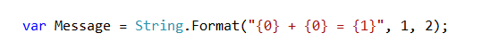
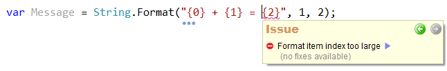
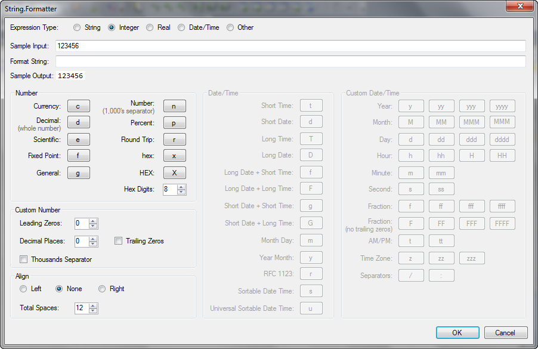

# 'Reverse Boolean' for CodeRush #

This plugin provides 3 enhancements:

  * A Tab to Next Reference extension.
  * A CodeIssue.
  * A Builder Dialog.

# Usage  #

### Tab to Next Reference Extension ###

Simply place the caret on a String.Format token (ie {0}) then press the Tab key. The Tab to Next Reference engine is engaged, and the user may now tab between the references to that token and the argument which will be used to fill it at run-time.

### CodeIssue - Format Item Index Too Large ### 

This CodeIssue highlights when the index of a token in a string.Format string references an argument which is not present.

### The Format String Builder Dialog ###

This dialog is available via the "Format Item..." entry on the Code SmartTagMenu.

This entry is available when the users caret is within a String.Format token. (ie {0})

When chosen the user is presented with a dialog designed to aid them in the building of a suitable FormatString which, upon acceptance, will replace the original item in the string from which the dialog was requested.

